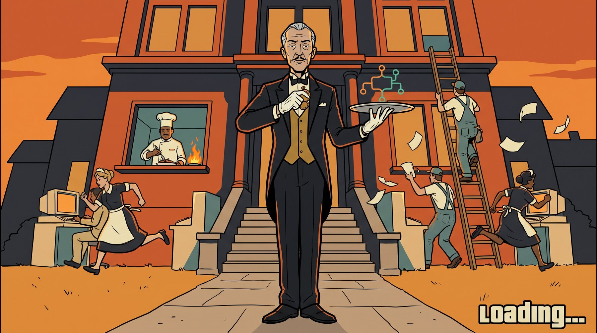
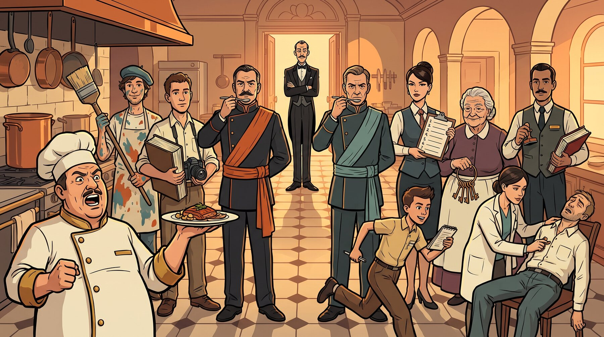

<div align="center">


# MAESTRO

### Every genius needs staff.

A Claude Code plugin that stops your session from doing the work itself. It hires,
briefs and inspects a staff of fifteen specialists — sixteen seats, counting his
own — writes down everything they do, and interrupts you only when the decision is
genuinely yours.

<p>


</p>

</div>



## The premise

Your codebase is an estate. A large one. Frankly, larger than you can run.

You used to answer the door yourself. Fix the boiler yourself. Argue with the
gardener about the hedge line, personally, at midnight, with a flashlight and 600
lines of logs in your head.

Sessions died young. Work got redone. Nobody kept the register.

Then you hired Maestro.



## What he actually does

**The staff table.** Sixteen seats, filled the day you install him, never improvised
mid-shift. (Closed roster: three implementer families, three reviewers, a planner,
two consiglieri, and the household — scout, researcher, context-keeper,
crystallizer, night clerk, house doctor.)

**The register.** "Tests pass" is not a sentence. It is a stamped entry with an exit
code. Not in the register? It didn't happen. (`.maestro/ledger.jsonl`, append-only,
written only by the machine layer — never by a model in a hurry.)

**Wings under renovation.** Nothing is built in the lived-in rooms, and no chef
tastes only his own soup: a change is signed off by a *different* model family
before it rejoins the house. (Worktree isolation plus mandatory cross-family
review. That floor cannot be lowered.)

**The estate survives the night.** Dismiss the entire staff mid-job. At dawn a new
staff reads the register and resumes at the exact brick. (Per-step checkpoints; a
restart is reconciliation, not re-planning.)

**One drawer for your decisions.** Questions that are truly yours pile up neatly in
one place. Nothing else knocks — no retry narration, no progress theatre.
(Holds queue plus a short escalation whitelist.)

**The two consiglieri.** When the household disagrees, it argues in a closed room —
two passes, no more — and comes out with one answer, or brings you both positions
verbatim. (Convergence pass between the families not involved in the dispute.)

<details>
<summary><b>The staff, in full</b></summary>

<br>



| Household role | Seat | Note |
|---|---|---|
| The chef de cuisine | `executor-sol` | GPT-5.6-Sol via Codex CLI. Does most of the actual cooking. |
| The visiting artist | `executor-claude` | Opus 5. Called in for the frescoes and the façade. |
| The new hire from abroad | `executor-gemini` | Gemini 3.1 Pro. Third kitchen, enormous pantry. |
| The inspectors | `reviewer-claude` · `reviewer-sol` · `reviewer-gemini` | Always from a different kitchen than the cook. |
| The secretary | `planner` | Turns "fix everything" into numbered errands with acceptance criteria. |
| The two consiglieri | `convergence` · `plan-counterpart` | Argue in a closed room. Two passes. One answer. |
| The housekeeper | `context-keeper` | Remembers what you meant, not just what you said. |
| The errand boy | `scout` | Fast, cheap, reads everything, touches nothing. |
| The librarian | `researcher` | Comes back with citations or doesn't come back. |
| The archivist | `crystallizer` | Reads the whole diary so nobody else has to. Hands you one page. |
| The night clerk | `handoff-recorder` | Writes down how the day ended. No poetry. |
| The house doctor | `fleet-medic` | Walks the halls, checks pulses, notes who is pretending. |
| The majordomo | `maestro` | Conducts. Never carries anything. There is a law against it. |

</details>

## Install — Sir does not carry luggage.



```sh
git clone https://github.com/Fredasterehub/maestro.git
claude --plugin-dir ./maestro
```

Or copy it into your plugins directory once and have him at every session.

One caveat, and he is firm about it: remove any competing orchestration layer from
your global `CLAUDE.md` first. Two butlers in one house will spend the entire day
arguing about the silverware.

## The house, drawn

<div align="center">



<sub><i>Every job gets its own wing. Nothing rejoins the house unsigned.</i></sub>

<br><br>



<sub><i>Retry, then the closed room, then — and only then — your desk.</i></sub>

</div>

## Ringing for him

| Command | What you get |
|---|---|
| `/maestro:status` | Where everything stands: needs you, just landed, still moving, waiting in line. |
| `/maestro:handoff` | Before you close the house — everything worth keeping, moved somewhere durable. |
| `/maestro:doctor` | The house doctor walks the halls. Reads pulses, touches nothing. |
| `/maestro:audit` | The register read back to you: revise rates, ladder engagements, deaths in service. |

## Provenance

The policy layer — liaison discipline, escalation rules, restart-proofing — is
migrated from [firstmate](https://github.com/kunchenguid/firstmate) onto Claude
Code's own primitives: background subagents, worktree isolation, task
notifications. The worker contracts and roster design honour kiln's protocol work:
the report envelope, the dispatch brief, the verdict and stop vocabularies, the
convergence passes. No tmux, no watchers, no external processes.

Built with Claude Code and hardened across three evaluation iterations;
cross-family review was verified live rather than asserted. What is here is what
shipped — a fleet-of-projects registry, detached workers, push notifications and
milestone machinery are all deliberately outside v1.

<div align="center">
<br>

### Conduct. Don't labor.

<sub><a href="https://fredasterehub.github.io/maestro/">The house, at length</a> · <a href="LICENSE">MIT</a>. The staff is included.</sub>

</div>
