<div align="center">


# MAESTRO

### Every genius needs staff.

**His name is Oscar.**

A Claude Code plugin that stops your session from doing the work itself. It opens a
layer beneath your chair, puts sixteen seats in it — fifteen constructs and the
maestro — dispatches the work, has it signed off by a rival make, writes down
everything that happened, and interrupts you only when the decision is genuinely
yours.

<p>


</p>

</div>


## The premise

Beneath your session there is a layer. Nodes, edges, fan-outs, loops — the workflow
graph, running as a place rather than a diagram. Constructs work at the nodes. Work
moves along the edges. Your session is the surface; the dimension is everything under
it.

His name is Oscar. He has been running the layer for a very long time — nobody left
can say how long, and he rounds down out of politeness. He is never tired, never
surprised, and his ledger is perfect. He conducts. He touches nothing in the graph.
There is a law against it.

Before him you did it all on the surface. Argued with the linter yourself, at
midnight, with 600 lines of log held in your head. Sessions died young. Work got done
twice. Nothing was written down, so nothing could be resumed.

Then Oscar took the office.


## What he actually does

**The roster.** Sixteen seats, filled the day you install him, never improvised
mid-mission. (Closed roster: three implementer families, three reviewers, a planner,
two adversary cores, and the support tier — scout, researcher, context-keeper,
crystallizer, trace clerk, pulse monitor.)

**The trace.** "Tests pass" is not a sentence. It is a stamped entry with an exit
code. Not in the trace? It didn't happen. (`.maestro/ledger.jsonl`, append-only,
written only by the machine layer — never by a model in a hurry.)

**No maker audits its own make.** A construct builds in an isolated branch of the
graph, and a construct from a *rival* make signs the work before it rejoins the
trunk. The script that closes a mission refuses to record a same-make audit.
(Worktree isolation plus mandatory cross-family review. That floor cannot be
lowered.)

**The layer survives the night.** Kill every construct mid-mission. At dawn new ones
read the trace and resume at the exact node where the graph went dark. (Per-step
checkpoints; a restart is reconciliation, not re-planning.)

**One drawer for your decisions.** Questions that are truly yours pile up neatly in
one place. Nothing else knocks — no retry narration, no progress theatre. (Holds
queue plus a short escalation whitelist.)

**The adversary cores.** When the layer disagrees with itself, two constructs from
the makes not involved argue in a locked room — two passes, no more — and come out
with one answer, or bring you both positions verbatim. (Convergence pass between the
uninvolved families.)

<details>
<summary><b>The roster, in full</b></summary>

<br>


| Node | Seat | Note |
|---|---|---|
| The heavy build construct | `executor-sol` | GPT-5.6-Sol via Codex CLI. gpt make. Does most of the actual building. |
| The visiting artist | `executor-claude` | Opus 5. claude make. Called across for façade and creative work. |
| The wide-context construct | `executor-gemini` | Gemini 3.1 Pro. gemini make. Enormous addressable memory. |
| The auditors | `reviewer-claude` · `reviewer-sol` · `reviewer-gemini` | Always from a different make than the one that built. |
| The decomposer | `planner` | Turns "fix everything" into briefs with acceptance criteria. |
| The adversary cores | `convergence` · `plan-counterpart` | Two rival minds, one locked room. Two passes. One answer. |
| The context daemon | `context-keeper` | Holds what you meant, not just what you said. |
| The probe | `scout` | Fast, cheap, reads everything, writes nothing. |
| The deep-retrieval construct | `researcher` | Returns with citations or does not return. |
| The compressor | `crystallizer` | Reads the entire archive so nobody else has to. Hands back one page. |
| The trace clerk | `handoff-recorder` | Records how the run ended. One entry, no poetry. |
| The pulse monitor | `fleet-medic` | Walks the graph, marks nodes alive, dead, or pretending. |
| The maestro | `maestro` | Conducts the layer. Touches nothing in it. There is a law against it. |

</details>

## Install — Sir does not carry luggage.


```sh
claude plugin marketplace add Fredasterehub/maestro
claude plugin install maestro@maestro
```

Installed once, at user scope — he is at every session from then on. `claude plugin update maestro` when a new version lands.

One caveat, and he is firm about it: remove any competing orchestration layer from
your global `CLAUDE.md` first. Two conductors on one podium will spend the entire
session arguing about the downbeat.

## The dimension, drawn

<div align="center">



<sub><i>Nodes, edges, loops. One yellow edge leaves the plane. It ends at your chair.</i></sub>

<br><br>


<sub><i>The layer on disk. One directory per mission branch — and the trace that outlives all of them.</i></sub>

<br><br>


<sub><i>Revise, then the locked room, then — and only then — your chair.</i></sub>

</div>

## What you can ask him

| Command | What you get |
|---|---|
| `/maestro:status` | Where everything stands: needs you, just landed, still moving, waiting in line. |
| `/maestro:handoff` | Before you close the session — everything worth keeping, moved somewhere durable. |
| `/maestro:doctor` | The pulse monitor walks the graph. Reads nodes, touches nothing. |
| `/maestro:audit` | The trace read back to you: revise rates, ladder engagements, constructs lost in service. |

## Provenance

The policy layer — liaison discipline, escalation rules, restart-proofing — is
migrated from [firstmate](https://github.com/kunchenguid/firstmate) onto Claude
Code's own primitives: background subagents, worktree isolation, task
notifications. The worker contracts and roster design honour kiln's protocol work:
the report envelope, the dispatch brief, the verdict and stop vocabularies, the
convergence passes. No tmux, no watchers, no external processes.

Built with Claude Code and hardened across three evaluation iterations;
cross-family review was verified live rather than asserted. What is here is what
shipped — a fleet-of-projects registry, detached workers, push notifications and
milestone machinery are all deliberately outside v1.

<div align="center">
<br>

### Conduct. Don't labor.

<sub><a href="https://fredasterehub.github.io/maestro/">The dimension, at length</a> · <a href="LICENSE">MIT</a>. The staff is synthetic.</sub>

</div>
